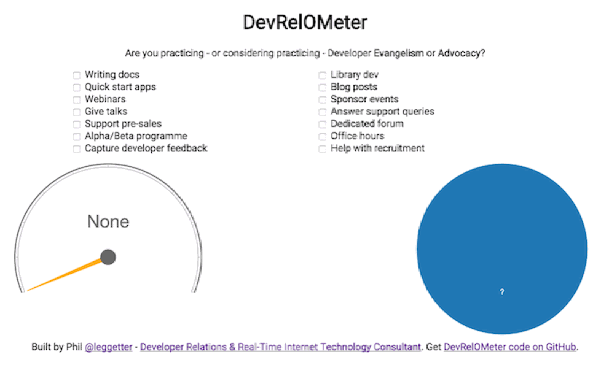

# DevRelOMeter

A Developer Relations Meter (DevRelOMeter) to determine if you are practicing - or considering practicing - Developer Evangelism or Advocacy.



## Blog post

I wrote a blog post on [Defining Developer Relations](http://www.leggetter.co.uk/2016/02/03/defining-developer-relations.html) which was the inspiration for the DevRelOMeter.

## Demo

https://leggetter.github.io/devrelometer/

## Prerequisites

* Node

## Install Dependencies

```bash
npm install -g jspm
npm install -g gulp-cli
npm install
```

## Run the demo

Runs a web server and launches the browser.

```bash
gulp
```

## Build

Builds to `dist`.

```bash
gulp build-dist
```

## Deploy to gh-pages

Pushes contents of `dist` to `gh-pages` of the `origin` remote `gh-pages` branch.

```bash
gulp deploy
```

## License

MIT
